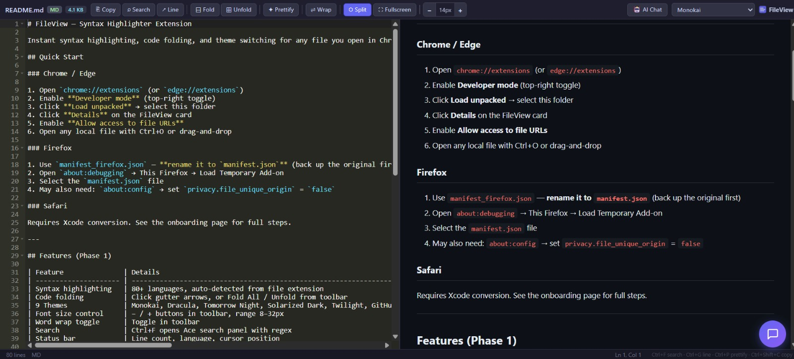
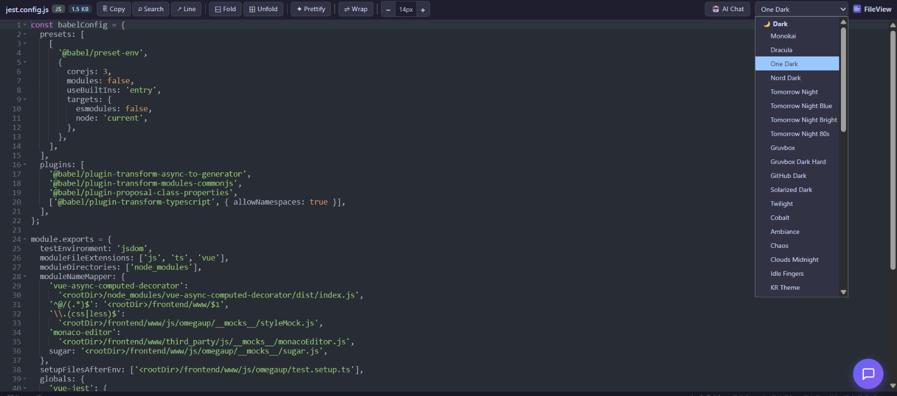
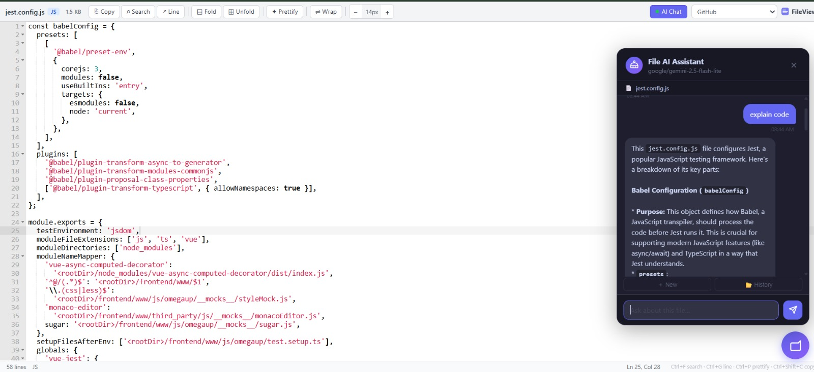
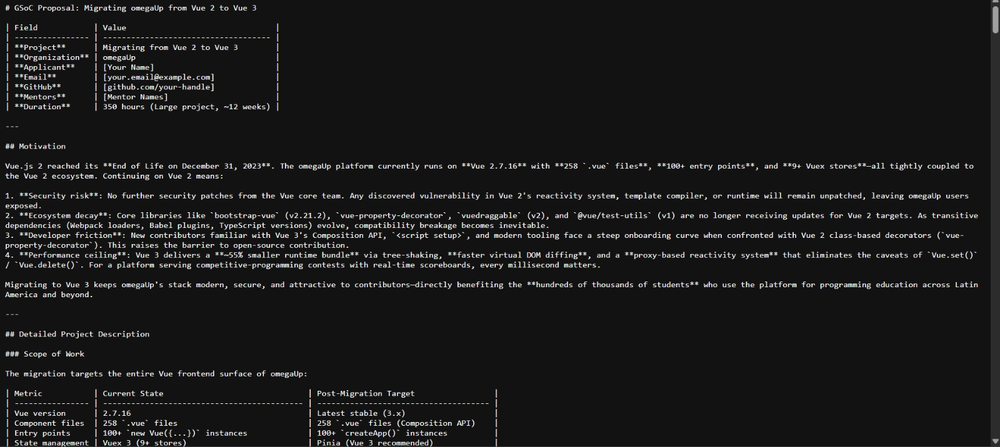

# FileView — Syntax Highlighter Extension

Instant syntax highlighting, code folding, and theme switching for any file you open in Chrome, Edge, or Firefox.

## Quick Start

### Chrome / Edge

1. Open `chrome://extensions` (or `edge://extensions`)
2. Enable **Developer mode** (top-right toggle)
3. Click **Load unpacked** → select this folder
4. Click **Details** on the FileView card
5. Enable **Allow access to file URLs**
6. Open any local file with Ctrl+O or drag-and-drop

### Firefox

1. Use `manifest_firefox.json` — **rename it to `manifest.json`** (back up the original first)
2. Open `about:debugging` → This Firefox → Load Temporary Add-on
3. Select the `manifest.json` file
4. May also need: `about:config` → set `privacy.file_unique_origin` = `false`

### Safari

Requires Xcode conversion. See the onboarding page for full steps.

---

## Features (Phase 1)

| Feature               | Details                                                                                               |
| --------------------- | ----------------------------------------------------------------------------------------------------- |
| Syntax highlighting   | 80+ languages, auto-detected from file extension                                                      |
| Code folding          | Click gutter arrows, or Fold All / Unfold from toolbar                                                |
| 9 Themes              | Monokai, Dracula, Tomorrow Night, Solarized Dark, Twilight, GitHub, Chrome, Tomorrow, Solarized Light |
| Font size control     | − / + buttons in toolbar, range 8–32px                                                                |
| Word wrap toggle      | Toggle in toolbar                                                                                     |
| Search                | Ctrl+F opens Ace search panel with regex                                                              |
| Status bar            | Line count, language, cursor position                                                                 |
| Large file protection | Files >2MB load first 5000 lines; option to load full file                                            |
| Settings persistence  | Theme, font size, word wrap saved via chrome.storage                                                  |
| Multi-browser         | Chrome (MV3), Edge (MV3), Firefox (MV2)                                                               |
| JSON prettify         | One-click formatting for JSON, XML, SQL, and more                                                     |
| Markdown preview      | Live split/preview, fullscreen, KaTeX, Mermaid                                                        |

## Supported Languages

JS/TS/JSX/TSX · HTML/CSS/SCSS · Python · Java · Rust · Go · C/C++ · C# · Kotlin · Swift · Ruby · PHP · Lua · JSON · YAML · TOML · XML · SQL · Shell/Bash · Markdown · Dockerfile · Makefile · INI/CFG · Diff/Patch · CSV · CoffeeScript

## File Structure

```
file-viewer-ext/
├── manifest.json              Chrome/Edge (MV3)
├── manifest_firefox.json      Firefox (MV2)
├── icons/                     Extension icons
├── src/
│   ├── content/
│   │   ├── content.js         Main content script (mounts Ace)
│   │   └── content.css        Layout + toolbar styles
│   ├── popup/
│   │   └── popup.html         Toolbar popup (theme/settings)
│   ├── onboarding/
│   │   └── onboarding.html    Setup guide (auto-detects browser)
│   └── background/
│       └── background.js      Opens onboarding on first install
└── vendor/ace/                Ace editor (bundled, no CDN)
    ├── ace.js
    ├── ext-modelist.js
    ├── ext-searchbox.js
    ├── theme-*.js             9 themes
    └── mode-*.js              35 language modes
```

## Known Limitations (Phase 2+)

- **No file editing** — Chrome extensions can't write to disk directly. Phase 3 will add Native Messaging for save support.
- **Git diff view** — planned for Phase 2

   